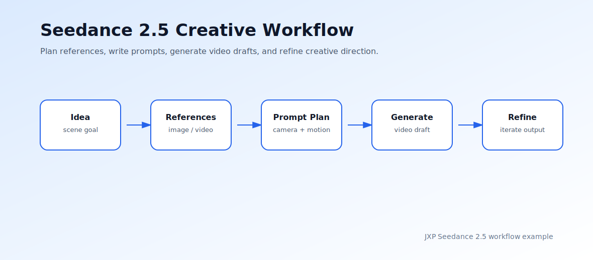
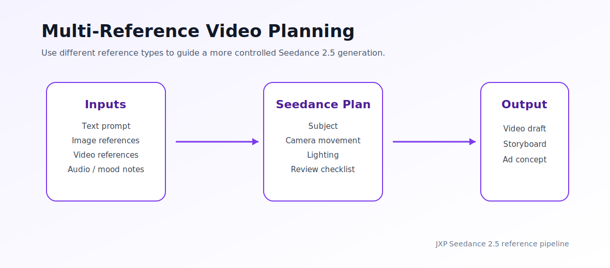

# Seedance 2.5 AI Video Generator

**Reference-guided AI video generation workflow | Text-to-video | Image-to-video | Long-form creative drafts**

[Try Seedance 2.5](https://www.jxp.com/seedance/seedance-2-5) | [Usage Guide](USAGE.md) | [Workflow Example](examples/seedance-workflow.svg) | [Prompt Template](prompt_template.json)



## Overview

[Seedance 2.5 AI Video Generator](https://www.jxp.com/seedance/seedance-2-5) is designed for creators, marketers, product teams, and video teams that need more structured AI video generation. Instead of relying only on a short prompt, the workflow can combine text direction, image references, video references, audio cues, and 3D-style creative notes to help users plan more consistent video drafts.

This repository provides a lightweight demo structure around the Seedance 2.5 workflow. It includes prompt templates, example diagrams, and a small Python helper that turns a creative brief into a reusable video-generation plan.

## Key Features

| Feature | Description |
| --- | --- |
| Text-to-video planning | Turn a written scene idea into a structured generation brief. |
| Image-to-video workflow | Use visual references to guide subject, style, product look, or first-frame direction. |
| Multi-reference inputs | Organize text, image, video, audio, and style references in one brief. |
| Longer video drafts | Plan AI video concepts for social clips, product demos, campaign previews, and storyboards. |
| 4K-oriented output planning | Prepare prompts and settings for higher-resolution creative review. |
| Iterative refinement | Track what to improve: motion, pacing, subject consistency, camera direction, or visual style. |

## Demo Workflow

```bash
python seedance_plan.py \
  --idea "A cinematic product demo showing a futuristic camera rotating on a clean studio table" \
  --style "cinematic product ad" \
  --duration 10 \
  --aspect-ratio "16:9"
```

The script writes a structured plan to:

```text
outputs/seedance-plan.json
```

## Repository Structure

```text
jxp-seedance-2-5-ai-video-generator/
├── README.md
├── USAGE.md
├── seedance_plan.py
├── prompt_template.json
├── examples/
│   ├── seedance-workflow.svg
│   └── reference-pipeline.svg
└── requirements.txt
```

## Example Use Cases

- Product demo video concepts
- Social media campaign drafts
- Cinematic advertising previews
- Character or object motion tests
- Image-to-video creative experiments
- Brand storytelling and launch teasers
- Previsualization for small video teams

## How It Fits a Creative Workflow

1. Write a short creative idea.
2. Add reference notes for subject, visual style, camera movement, and audio mood.
3. Generate a structured prompt plan.
4. Use the plan in [Seedance 2.5](https://www.jxp.com/seedance/seedance-2-5).
5. Review the output and refine motion, consistency, pacing, or style.



## Prompt Planning Checklist

- Main subject
- Scene environment
- Camera movement
- Lighting style
- Motion direction
- Reference images or videos
- Output duration
- Aspect ratio
- Refinement notes

## Roadmap

- [x] Seedance 2.5 workflow README
- [x] Prompt planning helper
- [x] Example SVG diagrams
- [x] Reusable JSON prompt template
- [ ] More campaign-specific prompt templates
- [ ] Example comparison notes for different aspect ratios
- [ ] Batch prompt planning examples

## Learn More

Visit [Seedance 2.5 AI Video Generator](https://www.jxp.com/seedance/seedance-2-5) to try the full AI video generation workflow.
